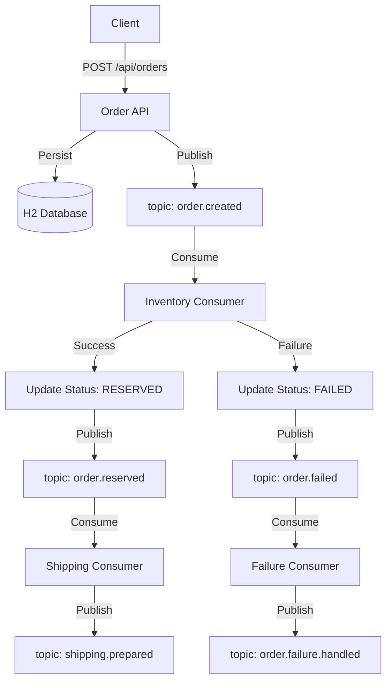

# Event-Driven Order Processing System

## Overview
This project is a Spring Boot event-driven backend that simulates a multi-stage order workflow. It demonstrates a robust microservices-like architecture using Spring Kafka for asynchronous communication between different components of the order lifecycle.

## Architecture Summary
The system is composed of several key components that handle specific stages of the order process:
- **Order API**: Handles incoming order requests, persists them to the database, and initiates the workflow.
- **Inventory Reservation**: Consumes order creation events and simulates inventory checks and reservations.
- **Order Status Management**: Orchestrates transitions between order states (e.g., PENDING, RESERVED, FAILED).
- **Outcome Event Publishing**: Publishes events based on the result of processing (Success/Failure).
- **Shipping Preparation**: Handles follow-up actions for successfully reserved orders.
- **Failure Handling**: Manages compensating logic or cleanup for failed orders.

## Workflow
1. **Client creates order**: A POST request to the Order API persists the order as `PENDING` and publishes an `OrderCreatedEvent`.
2. **Inventory processing**: The `OrderCreatedEventConsumer` picks up the event.
3. **Success path**:
    - Inventory is reserved (simulated).
    - Order status is updated to `RESERVED`.
    - An `OrderReservedEvent` is published.
    - The `OrderReservedEventConsumer` prepares shipping and publishes a `ShippingPreparedEvent`.
4. **Failure path**:
    - If inventory reservation fails (e.g., quantity > 5), order status is updated to `FAILED`.
    - An `OrderFailedEvent` is published.
    - The `OrderFailedEventConsumer` handles the failure and publishes an `OrderFailureHandledEvent`.

## Architecture Diagram


## Tech Stack
- **Java 17**
- **Spring Boot 3.2.5**
- **Spring Web** (REST API)
- **Spring Data JPA** (Persistence)
- **Spring Kafka** (Messaging)
- **H2** (In-memory Database)
- **JUnit 5 & Mockito** (Testing)
- **Maven** (Build Tool)

## Running the Project
### Prerequisites
- Java 17
- Maven

### Steps
1. Clone the repository.
2. Build the project:
   ```bash
   mvn clean install
   ```
3. Run the application:
   ```bash
   mvn spring-boot:run
   ```
*Note: As the project uses Spring Kafka, a running Kafka broker is expected for the application to function fully in a real environment. For development/testing, mocks or embedded Kafka can be used.*

## Testing
The project includes a comprehensive test suite covering all layers:
- **Controller Tests**: Verify API endpoints, request validation, and JSON responses.
- **Service Tests**: Ensure business logic, state transitions, and interactions with repositories.
- **Repository Tests**: Validate JPA persistence and mapping.
- **Consumer Tests**: Unit tests for `@KafkaListener` logic, verifying delegation to handlers.
- **Publisher Tests**: Verify correct topic usage and event publishing via `KafkaTemplate`.

To run all tests:
```bash
mvn test
```

## Design Decisions
- **Consumer Delegation**: Kafka consumers use a tiny `listen()` method for infrastructure and delegate business logic to a public `handle()` method. This makes the logic easily unit-testable without requiring a Kafka context.
- **Publisher Abstractions**: Messaging logic is hidden behind interfaces (e.g., `OrderEventPublisher`). This decouples the core business logic from the specific messaging implementation (Kafka).
- **Decoupled Infrastructure**: `KafkaTemplate` is not injected directly into consumers or main services, adhering to the Dependency Inversion Principle and keeping infrastructure concerns isolated.
- **Simulated Downstream Systems**: Services like `InventoryService` and `ShippingService` simulate external system interactions, providing a clear demonstration of event-driven flows without external dependencies.

## Future Improvements
- **Docker Compose**: Containerize the application along with a Kafka/Zookeeper/UI setup for easier local development.
- **Testcontainers**: Use Testcontainers for more robust integration testing with real Kafka and Database instances.
- **Dedicated Exception Types**: Replace generic `RuntimeException` with domain-specific exceptions for better error handling.
- **Externalized Configuration**: Move topic names and group IDs to `application.yml`.
- **Outbox Pattern**: Implement the Transactional Outbox pattern to ensure atomicity between database updates and event publishing.
- **Dead-Letter Queues (DLQ)**: Add DLQ support for handling unprocessable messages.
- **Observability**: Integrate Micrometer and OpenTelemetry for metrics and distributed tracing across the event flow.
