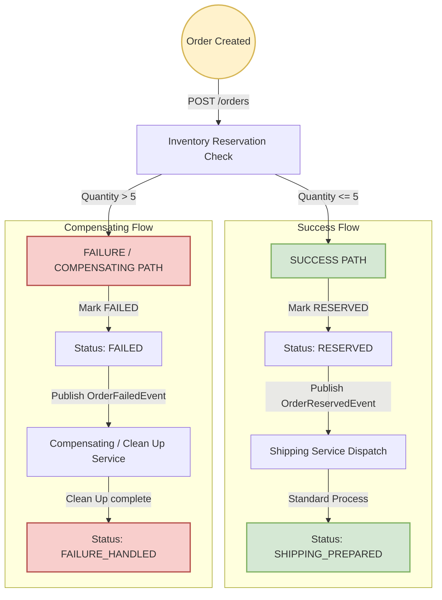

# Event-Driven Order Processing System

An enterprise-grade, highly resilient Spring Boot microservice demonstrating modern architectural patterns for event-driven coordination, transactional status state machines, non-blocking retry chains, and Dead Letter Queue (DLQ) compensation schemes.

---

## 🌟 Key Architecture Highlights

* **Spring Boot 3.2.5 & Java 17** foundation.
* **Dual-Mode Messaging Engine**: Pluggable event pipeline operating in **In-Memory (Local)** mode by default (silencing external TCP network dependencies) and **Production-Grade Apache Kafka** mode toggled seamlessly via Active Profiles.
* **Non-Blocking Resiliency Chain**: Implements Spring Kafka non-blocking retry loops with exponential backoff and automatic dead-letter topic routing.
* **Compensating Transactions**: Automates distributed compensating state rollbacks (DLQ alert captures and status audits).
* **Automatic Entity Auditing**: JPA auditing automatically tracks entity lifecycle timestamps (`createdAt` and `updatedAt`) persisted in H2.
* **Kafka UI Dashboard Integration**: Complete local multi-container stack including Zookeeper, Kafka Broker, and Kafdrop UI for real-time partition inspection.

---

## 📐 System Visual Architectures

### 1. Dual-Mode Messaging Engine
The application abstracts messaging behind clean event publishers. Depending on the active environment, event dispatches are routed either via low-latency synchronous virtual threads or fully asynchronous Kafka broker topics:

```mermaid
graph TD
    classDef memory fill:#d4f1f9,stroke:#00a3cc,stroke-width:2px;
    classDef kafka fill:#ffe6cc,stroke:#d79b00,stroke-width:2px;
    classDef db fill:#e1d5e7,stroke:#9673a6,stroke-width:2px;

    Client -->|HTTP POST /orders| API[Order Controller]
    API -->|Persist Order| DB[(H2 Database)]:::db
    
    subgraph Dual-Mode Messaging Engine
        API -->|Dispatch Event| Engine{Messaging Router}
        Engine -->|Profile: default| MEM[In-Memory Local Mode]:::memory
        Engine -->|Profile: kafka| KAF[Spring Kafka Mode]:::kafka
    end

    MEM -->|Sync Thread Pool Handoff| Consumer[Event Consumers]:::memory
    KAF -->|KafkaTemplate| Broker[Apache Kafka Broker]:::kafka
    Broker -->|Topic: order.reserved| Listener[@KafkaListener]:::kafka
```

---

### 2. Transaction Workflow & Compensation State Machine
The system handles order creation, stock availability validation (compensating path triggered for quantities > 5), status adjustments, and final shipping preparation:



---

### 3. Asynchronous Non-Blocking Retry & DLT (Dead Letter Topic) Loop
When downstream processing fails under specific triggers (e.g. `productId` contains `fail-shipping` or quantity is `99`), the shipping consumer initiates a localized retry loop with an exponential multiplier backoff. If exhaustion occurs, the payload is directed to the Dead Letter Queue (`order.reserved-dlt`) where alerting hooks log the operational anomaly:

```mermaid
flowchart TD
    classDef init fill:#fff2cc,stroke:#d6b656,stroke-width:2px;
    classDef retry fill:#e1d5e7,stroke:#9673a6,stroke-width:2px;
    classDef dlt fill:#f8cecc,stroke:#b85450,stroke-width:2px;
    classDef success fill:#d5e8d4,stroke:#82b366,stroke-width:2px;

    Receive[@KafkaListener: order.reserved]:::init --> Check{Trigger Failure Condition?}
    
    Check -->|No: Standard Product| Standard[Process Shipping] --> Success[Publish ShippingPreparedEvent]:::success
    Check -->|Yes: productId contains 'fail-shipping' OR quantity == 99| Throw[Throw Exception]
    
    subgraph Spring Kafka Non-Blocking Retry Chain
        Throw --> Attempt1[Attempt 1: Fail]:::retry
        Attempt1 -->|Backoff: 1.0s| Attempt2[Attempt 2: Fail]:::retry
        Attempt2 -->|Backoff: 2.0s| Attempt3[Attempt 3: Fail]:::retry
    end

    Attempt3 -->|Max Retries Reached| DLT[Route to Dead Letter Topic: order.reserved-dlt]:::dlt
    DLT --> DltHandler[@DltHandler: Log Exhaustion & Alert Ops]:::dlt
```

---

## 🛠 Tech Stack Details

* **Core Language**: Java 17 (Temurin JRE)
* **Framework**: Spring Boot 3.2.5
* **REST & Web**: Spring Web MVC
* **Data Layer**: Spring Data JPA, Hibernate, and H2 In-Memory Database
* **Messaging Broker**: Apache Kafka (Confluent cp-kafka:7.4.0)
* **Testing Library**: JUnit 5, Mockito, MockMvc, and Spring integration slices
* **Containers**: Docker, Docker Compose
* **Observability UI**: Kafdrop Web Dashboard (obsidiandynamics/kafdrop:4.0.1)

---

## 🚀 How to Run the System

### Mode A: Zero-Dependency In-Memory Local Run (Default)
Ideal for standard local verification without spinning up Docker containers. All event routing is run asynchronously using non-blocking virtual thread handoffs.

1. **Clean and Compile**:
   ```bash
   mvn clean install
   ```
2. **Launch the Boot App**:
   ```bash
   mvn spring-boot:run
   ```
3. **Verify API Access**:
   Access H2 Database Console: [http://localhost:8080/h2-console](http://localhost:8080/h2-console) (JDBC URL: `jdbc:h2:mem:orderdb`, Username: `sa`, Password: `password`).

---

### Mode B: Full Asynchronous Production-Style Kafka Run (Docker Compose)
Fully boots Zookeeper, Kafka, Kafdrop UI, and the microservice inside a virtual bridge network.

1. **Build the container images and launch the stack**:
   ```bash
   docker compose up --build
   ```
2. **Access Kafka Inspection Portal**:
   Open [http://localhost:9000](http://localhost:9000) inside your web browser. You can visually track broker clusters, consumer groups, partitions, and topics like `order.created`, `order.reserved`, and `order.reserved-dlt`.
3. **Shutdown and Clean Volumes**:
   ```bash
   docker compose down -v
   ```

---

## 🔌 API Documentation & Endpoint Specification

All responses return standard HTTP body schemas containing audit timestamps (`createdAt`/`updatedAt`) in ISO-8601 format.

| HTTP Method | Path | Description | Request Body Payload Example | Response Code |
| :--- | :--- | :--- | :--- | :--- |
| **`POST`** | `/orders` | Submit a new order into the processing pipeline | `{"productId": "prod-123", "quantity": 3}` | `201 Created` |
| **`GET`** | `/orders` | Retrieves all registered orders in the H2 Database | *None* | `200 OK` |
| **`GET`** | `/orders/{id}` | Fetches a single order details by its DB ID | *None* | `200 OK` / `404 Not Found` |
| **`GET`** | `/orders/{id}/workflow` | Fetches the real-time workflow stage progress of an order | *None* | `200 OK` / `404 Not Found` |
| **`GET`** | `/orders/workflows` | Retrieves workflow stages, retry audits, and DLQ markers for all orders | *None* | `200 OK` |

### Workflow State Response JSON Schema
`GET /orders/{id}/workflow` returns:
```json
{
  "orderId": 1,
  "currentStage": "DEAD_LETTERED",
  "retryCount": 3,
  "maxRetries": 3,
  "dlqRouted": true,
  "lastEventName": "order.reserved-dlt",
  "lastErrorMessage": "Simulated shipping service exhaustion.",
  "updatedAt": "2026-05-19T01:13:23.040"
}
```

### Chronological Workflow Auditing Stages
The dashboard tracks the order transition across the following unified stages:
* **`CREATED`**: Order initialized in the database.
* **`INVENTORY_CHECK_STARTED`**: Quantity availability validation initiated.
* **`RESERVED`**: Stock secured successfully.
* **`FAILED`**: Stock validation failed (Quantities > 5).
* **`FAILURE_HANDLED`**: Compensating rollback transaction finalized.
* **`SHIPPING_PREPARATION_STARTED`**: Handed off to logistics.
* **`RETRYING_SHIPPING`**: Non-blocking backoff retry attempt in progress.
* **`SHIPPING_PREPARED`**: Order shipped successfully.
* **`DEAD_LETTERED`**: Retry budget exhausted; safely isolated in DLQ.

---

## 🧪 Scenario Demonstrations & Triggering Commands

Use `curl` or any API client (e.g. Postman) to trigger the simulated event behaviors:

### 1. Trigger Successful Order Processing Flow
* **Behavior**: Quantity is $\le 5$ and product name is standard. The order will progress through `CREATED` $\rightarrow$ `RESERVED` $\rightarrow$ `SHIPPING_PREPARED`.
* **Action Command**:
  ```bash
  curl -X POST http://localhost:8080/orders \
       -H "Content-Type: application/json" \
       -d '{"productId": "laptop-pro", "quantity": 3}'
  ```
* **Verify Workflow State**:
  ```bash
  curl http://localhost:8080/orders/1/workflow
  ```

### 2. Trigger Inventory Reservation Compensation Flow
* **Behavior**: Quantity is $> 5$. The inventory reservation fails, and compensating hooks mark the status as `FAILED` and log `OrderFailureHandledEvent` for cleanups.
* **Action Command**:
  ```bash
  curl -X POST http://localhost:8080/orders \
       -H "Content-Type: application/json" \
       -d '{"productId": "laptop-pro", "quantity": 10}'
  ```
* **Verify Workflow State**:
  ```bash
  curl http://localhost:8080/orders/2/workflow
  ```

### 3. Trigger Downstream Non-Blocking Retry & DLQ Shipping Flow
* **Behavior**: Product ID contains the failure tag `fail-shipping` or quantity is exactly `99`. The inventory is successfully reserved (`RESERVED`), but the shipping processing encounters exceptions. It retries 3 times exponentially and then routes to `order.reserved-dlt`.
* **Action Command**:
  ```bash
  curl -X POST http://localhost:8080/orders \
       -H "Content-Type: application/json" \
       -d '{"productId": "laptop-fail-shipping", "quantity": 2}'
  ```
  *Monitor your console or Kafdrop portal to see the retries and dead-letter routing logs!*
* **Verify Retry / DLQ Audit States**:
  ```bash
  curl http://localhost:8080/orders/3/workflow
  ```

---

## 🧪 Testing Suite
The codebase is validated by **39 high-fidelity JUnit 5 tests** checking controller bounds, entity validation constraints, JPA auditer mappings, consumer thread delegations, mock template publishing, retry/DLQ states, and workflow endpoint serialization.

To execute the test suite:
```bash
mvn test
```
